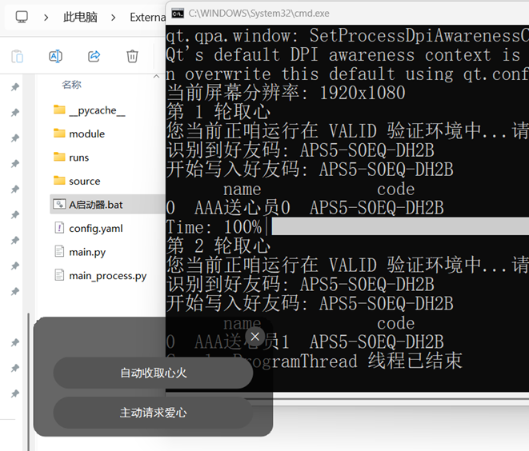
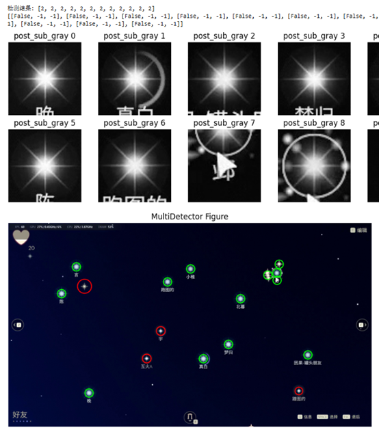
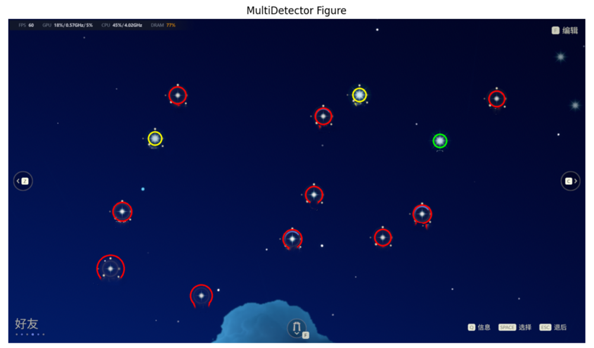

# __光遇全自动跑图程序__

本程序基于计算机视觉与人工智能算法开发，高度类似于人类，仅适配电脑端

### __软件安装__

```
conda install pytorch==2.5.1 torchvision==0.20.1 torchaudio==2.5.1 pytorch-cuda=12.1 -c pytorch -c nvidia
```

如果不用 Anaconda 的用户考虑使用下面的命令，同时 PyTorch 已经不需要再手动安装 CUDA 和 cuDNN 了

```
pip install torch==2.5.1 torchvision==0.20.1 torchaudio==2.5.1 --index-url https://download.pytorch.org/whl/cu121
```

之后安装 requirements.txt 安装好依赖，之后就可以直接运行 Python 程序

```
pip install requirements.txt
```

目前版本送心火使用的是 ui.py 我们直接打开它就行，没有其他要求，屏幕分辨率最好是 1920x1080 的

```
python ui.py
```


### __功能详情__

软件当前的 UI 是这样的



UI 正在开发中...

|功能|
|-----|
|自动送心火|
|主动领心|


__功能仍在开发中，请耐心等待__

### __自动收发心火__

使用计算机视觉方案获取屏幕上的亮点特征后进行分析

走传统计算机视觉路线了, 开始抓取图片中心的旋转不变特性, 还能顺便清理一下文字的那些杂色

之后我们再根据相似的特征来进行筛选, 直接绘制出八个方向的折线图

目前这一版是我比较满意的一版，可以看出来已经能识别出爱心、还有其他需要收、送心火的点





HSV 色相检测爱心，之后用四角星检测是否需要送心火，八角星不需要送

最后加上了星屑检测，这个不是很准，所以可能会有多点的时候，霉逝的这个不难判断

我们使用 Space 来控制进入，这样就省略了很多麻烦的东西

### __主动取心__

由于本人技术有限所以只能做到这种地步，下面这种的想必大家都比较眼熟


可以取这种形式的心，同时该类网站一般没有反爬措施，所以请注意爬取频率

因为今天的链接都领完了所以这次没办法再领了

### __自动游走跑图__

使用目标检测算法确定物体位置并使用强化学习算法控制任务游走

使用的算法为 YOLOv11，因为 YOLOv12 引入了注意力机制

RTX 3050 LapTop 所以不支持 flash_attn 所以运行速度较慢, 使用 CUDA 加速

之后打算使用深度强化学习进行学习, 所以我只能说路漫漫...