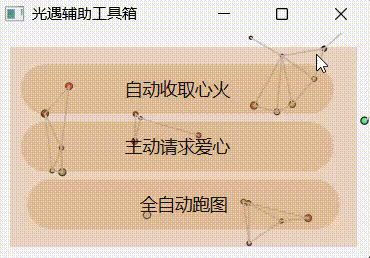

# __光遇辅助程序__

本程序基于 **计算机视觉** 与 **人工智能算法**开发，高度类似于人类，仅适配电脑端

使用时，请让光崽对准星盘，这样就可以点击按钮开始自动收集心火、获取爱心等行为。理论上屏幕是 16:9 的玩家都可以使用，假如你是 4:3 或者其他的...还没适配，目前支持 1920x1080。思路是对屏幕进行缩放裁剪，使用 16:9 的框进行裁剪，或者根据你的屏幕分辨率进行卷积核放缩...

### __软件安装__

```
conda install pytorch==2.5.1 torchvision==0.20.1 torchaudio==2.5.1 pytorch-cuda=12.1 -c pytorch -c nvidias
```

如果不用 Anaconda 的用户考虑使用下面的命令，同时 PyTorch 已经不需要再手动安装 CUDA 和 cuDNN 了

```
pip install torch==2.5.1 torchvision==0.20.1 torchaudio==2.5.1 --index-url https://download.pytorch.org/whl/cu121
```

之后安装 requirements.txt 安装好依赖，之后就可以直接运行 Python 程序

```
pip install -r requirements.txt
```

目前版本送心火使用的是 heart\ui.py 我们直接打开它就行，没有其他要求，屏幕分辨率最好是 1920x1080 的

**一定要注意，由于这类自动化程序需要很高的执行权限，所以务必在使用时保持管理员权限**

可以类似于我的启动器（heart\A启动器.bat）编写启动程序，先请求管理员权限后再执行就不会有问题了

```bat
@echo off

net session >nul 2>&1

if %errorLevel% neq 0 (
    powershell -Command "Start-Process '%~dpnx0' -Verb RunAs"
    exit /b
)


cd /d "%~dp0"

conda activate data && python ui.py
```

最后的那个 conda activate data && python ui.py 换成自己的启动语句就可以了

### __功能详情__

软件当前的 UI 是这样的，背景图用的是粒子旋转效果和连线，点击可以扩散和回弹




每次使用一个功能时，菜单会收起来，如果你想中断那只能打开任务管理器搜索 python 之后强制中断

好消息是因为屏幕只有一个进程只有一个所以我们不用考虑多线程导致的资源竞争，使用 QThread 也只是为了方便组织

在进程执行期间请不要控制 __任何 USB HID 输入设备__, 否则可能出现问题

|功能|目录|
|-----|-----|
|README静态文件|images|
|获取图像模态数据|data|
|光遇行为测试|sky-api|
|YOLOv11目标检测|yolov11|
|MoE模型导航|navigator|
|主程序|main|

功能仍在开发中，请耐心等待，但是由于这个商家居然还是月订阅领 999 心每天 3 颗所以我没有再续了, 打算废弃

### __自动收发心火__

使用计算机视觉方案获取屏幕上的亮点特征后进行分析

已经能识别出爱心、还有其他需要收、送心火的点，还可以识别文字在图片中的位置

（识别不是 100% 准确的，可能会有部分漏检、冗余操作等，且存在运行慢、计算量大等情况）


可以看出来里面有一些错误识别，但是那个情况只要速度不是极快的搜索是不会出现的

### __主动取心__

SIFT 方案已废弃，请暂时不要使用本方案

### __自动游走跑图__

使用目标检测算法确定物体位置并使用强化学习算法控制任务游走，使用的算法为 YOLOv11，因为 YOLOv12 引入了注意力机制

RTX 3050 LapTop 所以不支持 flash_attn 所以运行速度较慢, 使用 CUDA 加速的话要降级

打算使用对红色区域检测的方式增强这一片的对比度和掩膜，使用 MoE 模型省心省力，不过怎么配置奖励函数又是个问题，就用左上角蜡烛的状态变化吧

**哈哈，好消息是煮啵边复习边把 SLAM 修了，打算计算一下相机模型**，不过还正在想具体在光遇内测绘的方法，由于附近没有逆向大佬只能由数学人算了...
