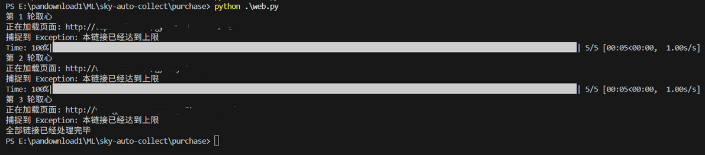
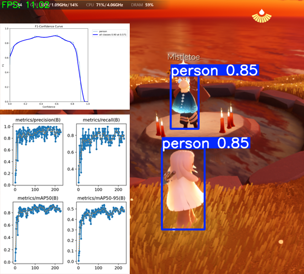

# __光遇辅助程序__

本程序基于计算机视觉与人工智能算法开发，高度类似于人类，仅适配电脑端

使用时，请让光崽对准星盘，这样就可以点击按钮开始自动收集心火、获取爱心等行为

### __软件安装__

```
conda install pytorch==2.5.1 torchvision==0.20.1 torchaudio==2.5.1 pytorch-cuda=12.1 -c pytorch -c nvidia
```

如果不用 Anaconda 的用户考虑使用下面的命令，同时 PyTorch 已经不需要再手动安装 CUDA 和 cuDNN 了

```
pip install torch==2.5.1 torchvision==0.20.1 torchaudio==2.5.1 --index-url https://download.pytorch.org/whl/cu121
```

之后安装 requirements.txt 安装好依赖，之后就可以直接运行 Python 程序

```
pip install -r requirements.txt
```

目前版本送心火使用的是 heart\ui.py 我们直接打开它就行，没有其他要求，屏幕分辨率最好是 1920x1080 的

__一定要注意，由于这类自动化程序需要很高的执行权限，所以务必在使用时保持管理员权限__

可以类似于我的启动器（heart\A启动器.bat）编写启动程序，先请求管理员权限后再执行就不会有问题了

```bat
@echo off

net session >nul 2>&1

if %errorLevel% neq 0 (
    powershell -Command "Start-Process '%~dpnx0' -Verb RunAs"
    exit /b
)


cd /d "%~dp0"

conda activate data && python ui.py
```

最后的那个 conda activate data && python ui.py 换成自己的启动语句就可以了

### __功能详情__

软件当前的 UI 是这样的，UI 仍然在开发中...


每次使用一个功能时，菜单会收起来，如果你想中断那只能打开任务管理器搜索 python 之后强制中断

好消息是因为屏幕只有一个进程只有一个所以我们不用考虑多线程导致的资源竞争，使用 QThread 也只是为了方便组织

在进程执行期间请不要控制 __任何 USB HID 输入设备__, 否则可能出现问题

|功能|目录|
|-----|-----|
|README静态文件|images|
|获取图像模态数据|data|
|光遇行为测试|sky-api|
|YOLOv11目标检测|yolov11|
|主程序|main|

功能仍在开发中，请耐心等待

### __自动收发心火__

使用计算机视觉方案获取屏幕上的亮点特征后进行分析

已经能识别出爱心、还有其他需要收、送心火的点，还可以识别文字在图片中的位置

（识别不是 100% 准确的，可能会有部分漏检、冗余操作等，且存在运行慢、计算量大等情况）


可以看出来里面有一些错误识别，但是那个情况只要速度不是极快的搜索是不会出现的

### __主动取心__

由于本人技术有限所以只能做到这种地步，下面这种的想必大家都比较眼熟


可以取这种形式的心，同时该类网站一般没有反爬措施，所以请注意爬取频率

我们首先需要调整 yaml 文件中的配置

```yaml
delay: 10 # 这个是个轮次之间需要等待的时间数
episode: 2 # 这个是我们需要取心的轮次
file: E:\pandownload1\ML\links.xlsx # 这个是我们取心链接的 Excel 表的绝对地址, 路径不要有空格
index: 0 # 起名编号, 取名为 "AAA送心员{index}"
texts: 
- "挚友" # 在这里修改你的挚友就可以了，记得要全部覆盖哦
- "举例1" # 就像这样在后面加就可以了
- "举例2"
```

之后正常运行就可以了，可以在后面确定参数 --yaml config.yaml 指定需要读取的 yaml 文件



有进度条不用担心卡死，其实是为了等待取心网页的后端服务器，根据自己的需求灵活调整

YOLOv11 的模型训练结果如下：

```
YOLO11s summary (fused): 100 layers, 9,413,187 parameters, 0 gradients, 21.3 GFLOPs
                 Class     Images  Instances      Box(P          R      mAP50  mAP50-95): 100%|██████████| 1/1 [00:00<00:00,  5.20it/s]
                   all         13         25      0.973       0.84      0.908      0.541
Speed: 0.3ms preprocess, 8.0ms inference, 0.0ms loss, 1.8ms postprocess per image
Results saved to sky_detection\yolo11n_sky
```



自动请求 Excel 内的 URL 之后开始访问，自动获取到好友邀请码到剪切板

之后我们进入光遇加好友都没有问题，可是问题在后面

我们加好好友后我们自动搜索到对应的星星，然后点击对应的星星并传送过去

之后我们能传送过去是能传送过去...__但是吧光遇他老卡一下__，卡完之后吧又能传进去...

这就导致了进来之后拿不到送心员送的东西，除非咱自己送他一个节点（相信没人愿意花这一根蜡烛）

然后吧我本来做的是根据渐暗（或渐亮）做的扫描，这样一来都乱了

后面对接的是 YOLOv11 + Bot-SORT 的目标跟踪，对齐较远目标后 SIFT 识别送礼图标

理论上能用但是现在受到光遇的重大打击，不建议 CPU 不太好的宝宝用...

在不卡顿的情况下测试通过，还没有进行更多测试

### __自动游走跑图__

使用目标检测算法确定物体位置并使用强化学习算法控制任务游走

使用的算法为 YOLOv11，因为 YOLOv12 引入了注意力机制

RTX 3050 LapTop 所以不支持 flash_attn 所以运行速度较慢, 使用 CUDA 加速

之后打算使用深度强化学习进行学习, 所以我只能说路漫漫...