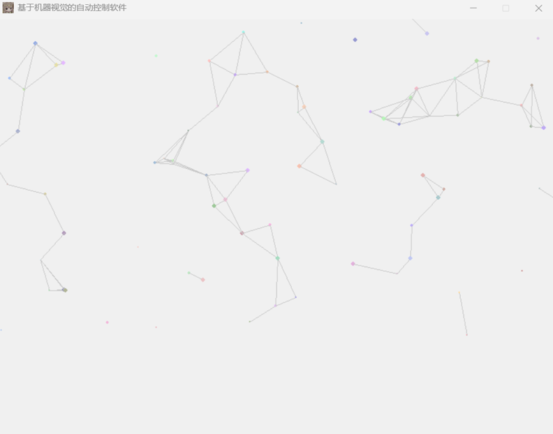

# 光遇全自动跑图程序

本程序基于计算机视觉与人工智能算法开发，高度类似于人类，仅适配电脑端

### 功能详情

软件当前的 UI 是这样的


UI 正在开发中...



1. 自动送心火

（功能仍在开发中）

### 心火位置检测

心火完全基于计算机图形学进行检测，效果如图所示


但是现在状态很不稳定，还有待解决，正在思考怎么解决，打算把这些文字都去掉...

### 主要逻辑

想要开发：使用目标检测算法确定物体位置并控制任务游走

使用的算法为 YOLOv11，因为 YOLOv12 引入了注意力机制，但是我是 RTX 3050 LapTop 所以不支持 flash_attn 运行的老慢了，而且我打算使用 yolo11n.pt 完全放弃精度，因为这种实时性比较高的任务最好还是考虑能不能及时处理，所以我们使用最小模型，同时使用 CUDA 加速

```
conda install pytorch==2.5.1 torchvision==0.20.1 torchaudio==2.5.1 pytorch-cuda=12.1 -c pytorch -c nvidia
```

如果不用 Anaconda 的用户考虑使用下面的命令，同时 PyTorch 已经不需要再手动安装 CUDA 和 cuDNN 了

```
pip install torch==2.5.1 torchvision==0.20.1 torchaudio==2.5.1 --index-url https://download.pytorch.org/whl/cu121
```

之后安装 requirements.txt 安装好依赖

```
pip install requirements.txt
```

